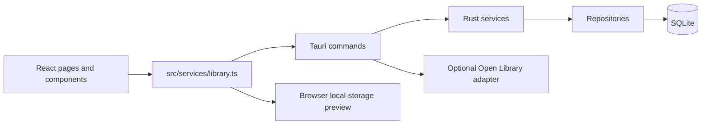

# Architecture and command boundary

Windows caption operations use a separate `src/services/window.ts` adapter and theme-integrated `WindowChrome`; Windows startup removes system decorations before creating the window. Other platforms retain native decorations. See `WINDOWS-CHROME.md` for behavior and verification.

Meridian is a local desktop catalog. React renders application state and calls `libraryService`; the native path uses Tauri IPC handlers, Rust services, and SQLite repositories. Browser preview is a separate local-storage simulation, not evidence of native persistence or parity.

## Ownership map

| Boundary | Source | Responsibility |
| --- | --- | --- |
| Presentation | `src/pages`, `src/components`, `src/styles` | Navigation, forms, display and interaction |
| Frontend adapter | `src/services/library.ts` | Typed operations and preview/native selection |
| Wire models | `src/types/index.ts`, `src-tauri/src/domain/mod.rs` | Shared shapes; Rust serde uses camelCase |
| Native commands | `src-tauri/src/commands/mod.rs` | Thin IPC handlers; metadata/export currently coordinated here |
| Services | `src-tauri/src/services/mod.rs` | Mutex-protected connection and use cases |
| Repositories | `src-tauri/src/repositories/mod.rs` | SQL, constraints, relation replacement and write transactions |
| Storage lifecycle | `src-tauri/src/database/mod.rs`, `migrations` | Connection settings and versioned migration |
| Startup | `src-tauri/src/lib.rs` | App-data directory, cover directory, debug-only seeds, command registration |

SQLite distinguishes works, editions and library copies. Author ordering belongs to the work; tags and collections link to copies; reading records link to copies. The current edit operation changes the latest reading record. Creating a book currently creates a new work and edition, and unique ISBN constraints prevent creating another edition with the same ISBN. Multiple-copy entry needs a dedicated operation later.

## Storage and recovery

Native startup opens `library.db` under the platform application-data directory. Foreign keys, WAL and a five-second busy timeout are enabled. Migration schema changes and their version marker now commit in one immediate transaction. Unversioned partial schema can be completed where existing definitions are compatible; incompatible definitions fail without committing additional changes. Supported schema version is 1; newer or negative maximum versions are rejected. A recorded version is trusted; comprehensive validation of corrupted versioned schemas is still a gap.

Create/update write the relational graph transactionally. A failed constraint leaves previous data intact. Migration failure rolls back schema work and can be retried after the underlying issue is corrected. Before any future destructive migration, provide a backup/recovery procedure. Downgrading a database is unsupported; reopen it with a compatible app version. Restore now saves an automatic recovery snapshot before replacement; periodic backups and undo remain planned.

Debug sample initialization is a single transaction and reuses existing named collections and their IDs. An empty debug catalog receives ten samples; a nonempty catalog is left alone. Release startup does not invoke seeding.

## Completion boundary

`docs/BASELINE.md` and `docs/PHASE0-SMOKE.md` record demonstrated behavior, outstanding acceptance checks and risks. `npm run verify` builds desktop bundles through a toolchain-aware wrapper. Separate `smoke-test` builds verify installation, native WebView/IPC commands, restart and 200% zoom against marked isolated storage. Normal builds exclude their driver and commands. These checks do not prove clean-profile installation or screen-reader accessibility. Backup/restore now has isolated round-trip, rollback and installed native IPC evidence; see BACKUP-RESTORE.md.

## Backup boundary

Frontend cover readiness lives in `src/services/coverReadiness.ts`, separate from native reference resolution in `library.ts`. One shared bounded decode queue serves every CoverImage surface, prioritizes visible requests, and preserves decoded images across page remounts. Successful restores invalidate both layers; generation checks prevent older work from populating a restored cache. See [cover navigation performance](COVER-NAVIGATION.md).

src-tauri/src/backup.rs owns schema-1 snapshot SQL, strict JSON validation in isolated storage, safe filesystem publication and transactional replacement. LibraryService owns the connection lock; commands delegate operations; Settings validates and confirms through libraryService. Legacy catalog export remains a separate consistent read. covers.rs owns bounded image decoding/normalization and immutable content-based storage. portable.rs owns staged ZIP inspection, review digests, complete recovery archives and cover publication before catalog commit. Native state shares LibraryService through an Arc so heavy operations can run on worker threads while preserving its connection mutex. UI surfaces use CoverImage and the typed service boundary. See COVERS-PORTABLE-BACKUP.md.
